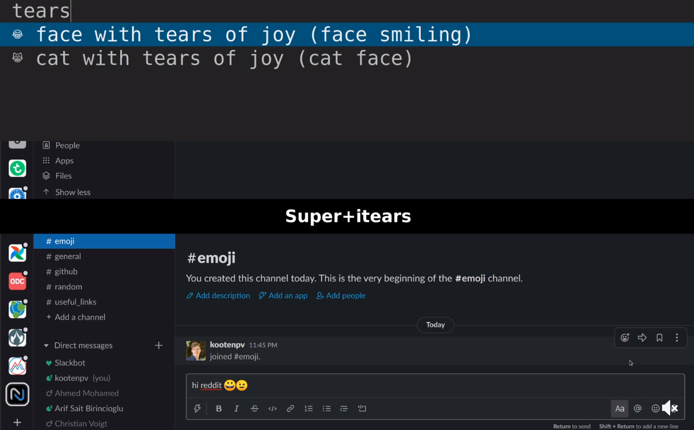

# emoji-picker

It contains the [script](https://github.com/kootenpv/emoji-picker/blob/master/emojis.py) to generate a list of emojis that can be used.

Currently I make it available using [dmenu](https://wiki.archlinux.org/index.php/Dmenu) in [i3](https://wiki.archlinux.org/index.php/i3), but on popular request we can see if it possible to make this available for Win/OSX.

The config in i3 is:

    bindsym $mod+i exec --no-startup-id \
      "cat ~/emojis.txt | dmenu -f -i -l 5 | cut -d ' ' -f 1 | python unicodepynput.py"

(ensure python refers to the full path and also provide the full path to `unicodepynput.py`)

